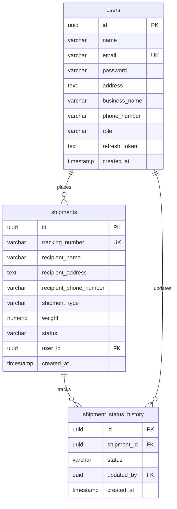

# ⚡ ShipSync - Backend API

<p align="center">
  
  
  
  
  
  
</p>

<p align="center">
  <strong>A scalable RESTful API backend for managing courier shipments, tracking history and role-based logistics operations.</strong><br />
  Built with TypeScript, Express.js and PostgreSQL using a clean layered architecture and raw SQL queries.
</p>

---

# 📖 Table of Contents

* [Core Features](#-core-features)
* [Technology Stack](#-technology-stack)
* [Project Structure](#-project-structure)
* [Database Schema](#-database-schema)
* [API Endpoints](#-api-endpoints)
* [Setup Guide](#-setup-guide)
* [Environment Variables](#-environment-variables)
* [Authentication Flow](#-authentication-flow)
* [Architecture Notes](#-architecture-notes)

---

# 🚀 Core Features

* 🔐 JWT Authentication with Access Tokens and Refresh Tokens
* 🛡️ Role-Based Access Control (RBAC) for `customer` and `admin`
* 📦 Shipment creation and shipment tracking
* 📜 Shipment status history auditing
* ✅ Request validation using Zod schemas
* 📈 Admin analytics and shipment statistics
* 🚨 Centralized global error handling
* ⚡ React Query friendly API architecture

---

# 🛠️ Technology Stack

| Layer             | Technology         |
| :---------------- | :----------------- |
| Runtime           | Node.js            |
| Backend Framework | Express.js 5       |
| Language          | TypeScript         |
| Database          | PostgreSQL         |
| Database Driver   | pg (node-postgres) |
| Validation        | Zod                |
| Authentication    | JWT + bcrypt       |
| API Style         | REST API           |

---

# 📁 Project Structure

```txt
backend/
├── src/
│   ├── config/
│   │   ├── db.ts
│   │   └── jwt.ts
│   │
│   ├── controllers/
│   │   ├── auth.controller.ts
│   │   ├── admin.controller.ts
│   │   ├── customer.controller.ts
│   │   └── shipment.controller.ts
│   │
│   ├── middleware/
│   │   ├── auth.middleware.ts
│   │   ├── error.middleware.ts
│   │   └── validate.middleware.ts
│   │
│   ├── repository/
│   │   ├── admin.repository.ts
│   │   ├── customer.repository.ts
│   │   ├── shipment.repository.ts
│   │   └── shipmentTracking.repository.ts
│   │
│   ├── routes/
│   │   ├── auth.routes.ts
│   │   ├── admin.routes.ts
│   │   ├── customer.routes.ts
│   │   └── shipment.routes.ts
│   │
│   ├── services/
│   │   ├── auth.service.ts
│   │   ├── admin.service.ts
│   │   ├── customer.service.ts
│   │   └── shipment.service.ts
│   │
│   ├── validations/
│   │   ├── auth.validation.ts
│   │   └── shipment.validation.ts
│   │
│   ├── types/
│   ├── utils/
│   └── server.ts
│
├── package.json
└── tsconfig.json
```

---

# 🗄️ Database Schema



---

# 🔌 API Endpoints

## 🔑 Authentication — `/api/auth`

| Method | Endpoint    | Description               |
| :----- | :---------- | :------------------------ |
| POST   | `/register` | Register new user         |
| POST   | `/login`    | Login user                |
| POST   | `/refresh`  | Generate new access token |
| POST   | `/logout`   | Logout user               |

---

## 📦 Shipment Routes — `/api/shipments`

| Method | Endpoint                | Access   |
| :----- | :---------------------- | :------- |
| POST   | `/create-shipment`      | Customer |
| GET    | `/get-my-shipment`      | Customer |
| GET    | `/get-my-status-counts` | Customer |
| GET    | `/search-shipment`      | Customer |
| GET    | `/track-shipment`       | Public   |

---

## 🛡️ Admin Routes — `/api/admin`

| Method | Endpoint                      | Access |
| :----- | :---------------------------- | :----- |
| GET    | `/get-shipment`               | Admin  |
| PATCH  | `/update-shipment/:id/status` | Admin  |
| GET    | `/get-status-counts`          | Admin  |
| GET    | `/get-customers`              | Admin  |
| GET    | `/get-top-customers`          | Admin  |

---

# ⚙️ Setup Guide

## Prerequisites

* Node.js v22+
* PostgreSQL v16+
* npm

---

## 1. Clone Repository

```bash
git clone https://github.com/your-username/courier-service-app.git
cd courier-service-app/backend
```

---

## 2. Install Dependencies

```bash
npm install
```

---

## 3. Create PostgreSQL Database

Open PostgreSQL shell:

```bash
psql -U postgres
```

Create database:

```sql
CREATE DATABASE courier_app_db;
```

Exit shell:

```sql
\q
```

---

## 4. Import Database Schema

```bash
psql -U postgres -d courier_app_db -f ../database/schema.sql
```

---

## 5. Configure Environment Variables

Create `.env` file inside backend folder:

```env
PORT=5000

DB_HOST=localhost
DB_PORT=5432
DB_USER=postgres
DB_PASSWORD=your_password
DB_NAME=courier_app_db

JWT_SECRET=your_access_secret
JWT_REFRESH_SECRET=your_refresh_secret

JWT_EXPIRY=15m
JWT_REFRESH_EXPIRY=7d
```

---

## 6. Start Development Server

```bash
npm run dev
```

Backend server runs on:

```txt
http://localhost:5000
```

---

# 📊 Environment Variables

| Variable           | Description              |
| :----------------- | :----------------------- |
| PORT               | Express server port      |
| DB_HOST            | PostgreSQL host          |
| DB_PORT            | PostgreSQL port          |
| DB_USER            | PostgreSQL username      |
| DB_PASSWORD        | PostgreSQL password      |
| DB_NAME            | PostgreSQL database name |
| JWT_SECRET         | JWT access token secret  |
| JWT_REFRESH_SECRET | JWT refresh token secret |
| JWT_EXPIRY         | Access token expiry      |
| JWT_REFRESH_EXPIRY | Refresh token expiry     |

---

# 🔒 Authentication Flow

```txt
Client
   │
   ├── Login Request
   │
   ▼
Backend API
   │
   ├── Validate Credentials
   ├── Generate Access Token
   ├── Generate Refresh Token
   │
   ▼
Client Receives:
   ├── Access Token (Response Body)
   └── Refresh Token (HttpOnly Cookie)

Protected Routes:
Authorization: Bearer <token>
```

---

# 🏛️ Architecture Notes

## Layered Architecture

The backend follows a layered architecture structure:

* Routes → API endpoint definitions
* Controllers → Request handling
* Services → Business logic
* Repository → Raw SQL database queries
* Middleware → Authentication, validation, and error handling

---

## Raw SQL Approach

Raw SQL queries were used instead of an ORM to:

* Keep query control simple
* Improve SQL learning and debugging
* Reduce unnecessary abstraction layers
* Optimize query performance

---

## Validation Strategy

Zod validation middleware is used to:

* Validate incoming requests
* Keep controllers clean
* Return consistent validation errors
* Improve API reliability

---

## Error Handling

The application uses:

* Centralized global error middleware
* Custom `AppError` class
* Consistent JSON error responses

---

# 👨‍💻 Development Notes

This application was built focusing on:

* Clean architecture
* Type safety
* Scalable backend structure
* Authentication & authorization
* API performance
* Maintainable code practices
